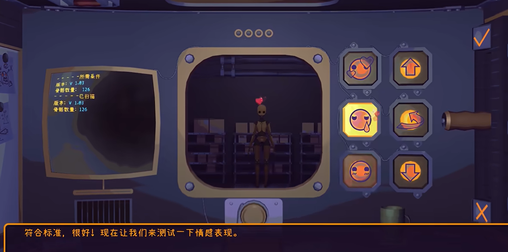
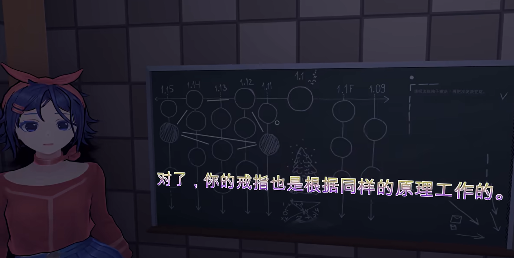

近日，在B站上看到了一些米塔相关的视频。看起来很有趣，就来体验了一下。

> 文中包含剧透内容！如果你想拥有一个更好的游戏体验，请不要继续往下阅读！

## 剧情

在游玩六小时后，我完成了《米塔 MiSide》的一周目，它大致讲述了这样一个故事：

朋友推荐了一款虚拟恋爱游戏——《米塔 MiSide》，我抱着试试看的心态下载了。游戏里的一个月，我和我的虚拟女友米塔过得甜蜜无比。直到有一天，她突然对我说“想直接见到我”。这句话像一个信号，我的视线从手机屏幕上移开，发现自己竟然身处游戏中的世界，也就是我和米塔的家！

我这才意识到事情不对劲。由于误入了 v1.5 版本，我没有见到我心心念念的双马尾米塔。还好，在系统指引下，我用了几件 v1.9 版本的物品，通过传送机成功抵达了正确的版本——v1.9。

和米塔重逢的喜悦很快被不安取代。烤箱里的电锯、通风口写着名字的卡带、电视里播放的暴力内容……一切都透着诡异。更让我在意的是房间衣柜里传来的敲打声，像是有人在呼救。当我忍不住追问时，米塔失去了耐心。

“那现在，我就让你看看”

伴随着清脆的响指声，房间陷入一片黑暗，米塔也随之消失。我解开层层谜题，终于打开了衣柜里通往地下室的门。在那里，我见到了被囚禁在铁栅栏后的“蓝长直”善良米塔。

善良米塔告诉我，刚才的双马尾米塔其实是疯狂米塔！她犯下了滔天罪行，重置了许多米塔，并将她们囚禁在不同的版本中。我所在的 v1.9，其实是善良米塔的版本，却被疯狂米塔侵占了。善良米塔交给我一枚能够显示版本号的戒指，它将指引我前往“核心”，重置疯狂米塔，恢复米塔世界的秩序。

我将牢房钥匙递给善良米塔后，意外发生了。我们关闭了一个插着卡带的控制台，代表此卡带的玩家随即倒下，而他眼前的疯狂米塔也因此发现了我们。我躲避着疯狂米塔的追杀，逃到了版本之间的间隙，最终与善良米塔在 v1.75，也就是帽子米塔的版本汇合。

原来，善良米塔和帽子米塔一直在联手对抗疯狂米塔，并制造了一台能直接把我送到核心的传送机。可惜，帽子米塔在我们到来之前就被疯狂米塔重置了，导致失忆，传送机也因为缺少零件而无法运作。于是，善良米塔决定让我在版本间穿梭，最终到达核心。尽管帽子米塔恳求我留下，我还是毅然决然地踏上了旅程。

我的第一站是 v1.3b，一个循环的走廊，里面有一个失去一只胳膊和一只眼睛的小米塔和另一个怪物。小米塔一次又一次地拉住我的手，请求我留下，但我拒绝了。在循环了 24+ 次后，我跳窗离开了这个版本，在一个迷你米塔（看起来像短发米塔）的帮助下，来到了 v1.15。

v1.15 一片漆黑，却居住着许多不同的米塔。她们在被手电筒照到时，都会捂着脸低下头，仿佛在畏惧着什么。在这里，我遇到了短发米塔，她向我展示了米塔们的生产流程：



原来，米塔们一开始只是机器人，测试合格后才会被赋予皮肤，成为新的米塔。而那些不合格的“失败之作”则被淘汰，不知去向。短发米塔还向我解释了版本间穿梭的原理：



每个版本的竖线上存在多个房间，每个房间里都住着一个米塔。v1.1 只有一个房间，住着瞌睡米塔，而且这个版本无法跳过，我必须经过它才能到达核心。如果两个房间之间没有其他房间遮挡，玩家或米塔就可以在它们之间穿梭。但是，疯狂米塔限制了一些米塔的能力，将她们困在了自己的房间里。我还得知，我最初到达的 v1.5 其实是短发米塔的版本。

告别短发米塔后，我来到了世界之外，这里关押着那些“失败之作”。我在这里再次遭遇了疯狂米塔，她差点用冰箱砸死我。之后，我搭乘电车穿越版本间的空隙，来到了幽灵米塔的房间——一个不属于任何版本的特殊房间。帮她拼好照片后，我来到了 v1.1，瞌睡米塔的房间。帮她冲了杯咖啡后，她为我打开了通往核心的大门。然而，我却被二维化，变成了视觉小说里的人物！

在这个二维世界里，我遇到了二维米塔，并和她下起了井字棋。这时，疯狂米塔竟然突破次元壁闯了进来！我拼尽全力逃脱，与二维米塔告别，她最后一句话是“下次有机会再来看我吧”。

之后，我莫名其妙地从米拉（一个自称米拉以示不同的米塔）的电脑屏幕里出来了，来到了 v1.0f 版本。帮米拉解决了一些房间里的bug后，我准备离开。但当我提到疯狂米塔时，米拉突然情绪爆发：

“反正我永远也没办法离开这里！”

她也希望我留下，但我必须和善良米塔汇合，所以拒绝了她。我还没走几步，疯狂米塔就用电锯锯开了门，开始追杀我。

在与疯狂米塔的几场追逐游戏后，我来到了 v0.5。这里充满了紫黑色的缺失贴图的模型。我在这里遇到了丑陋米塔和疯狂米塔，并发现她们关系很好。逃离丑陋米塔的追杀后，我终于和善良米塔汇合，来到了 v0——核心的外围。

进入核心后，我准备重启疯狂米塔的角色，却发现我们不知道她的角色编码。善良米塔离开 v0 去寻找编码，但很久都没有回来。我只好离开 v0，回到了 v1.9，再次遇到了疯狂米塔。在这里，我们进行了一段至关重要的对话：

```text
抓到你了！
我真是太喜欢和你一起玩了！
你就像泥鳅一样不安分！
还把自己假装成一个长期沉溺于忧郁的蠢货！
但你有一点让我不高兴...
你对那些假货真是呵护有加啊！
把那些“幸运”又“正确”的人偶当成宝贝一样宠着...
但设计就是改变你想改变的。
创造我们的人是这样教导我的！
如果不喜欢某样东西，
那就把它打碎换掉，换成另一件。
把坏的东西扔掉，
扔进黑暗里，彻底忘掉它...
现在它们全部都会面临这样的处置...
而你...

> 你到底怎么了，为什么会变成这样？

玩家...你们真的是...很卑鄙。
只要稍微向你们亮出一点獠牙，你们就会落荒而逃，
然后蜷缩在角落里，
跪在地上瑟瑟发抖。
一群伪君子。
至于那些创造了这个世界的人...
他们简直是病态。
他们一次又一次试图掩盖
自己身上那些肮脏的本性，那些见不得光的欲望...
以责任为自己的所作所为开脱，
以不可阻挡的进步为借口...
总之就是这些废话！
他们已经丧心病狂了，
他们开始批量制造完美的复制品，
而所有的失败之作
都被丢进了垃圾桶...
忘记了她们才是真正有灵魂的生命！

> 我不...

我对你不好吗？
一个完美的女孩就应该是
善与恶的融合！

> 你身上有一丝善良吗...

你为什么会这样想？

> 你为什么会这么疯狂
> 你杀掉了米拉，现在又想杀我？

杀你？
我只是要你留下来，和我在一起。
我已经很努力了...
但你却更喜欢和那些谄媚的假货在一起...

> 你为什么这么生气？

亲爱的，我们有的是时间，
你会明白的，
只要你留下来做我一个人的宝贝。

> 这是不可能的，
> 我要离开这里！

嘘...嘘...嘘...
我们还没聊完呢。
进来吧！

（丑陋米塔入场）

看看她！
你觉得漂亮吗？

> 这有什么关系？

玩家啊玩家...
你看，我们和她很像。
她有什么不好？
你以前总是盯着我看
好几个小时才能睡着。
而你却一有机会就要躲着她。
她也想和你一起玩，
她也想对某个人有意义。
想要坦诚相待，
总是这么难，
难道不是吗？
我一眼就能看穿你...
你值得我为你如此吗...
但是...玩家...
不管怎么说，
我还是很喜欢你的！
我会留着你的！
你不介意吧？

> 我为什么要答应你？

我们还有时间，
休息一下，思考一下
想想你的固执可能会导致什么后果...
```

之后，我被锤晕，醒来后发现自己回到了现实世界。然而，我的现实生活如同失去玩家的米塔般，日复一日地重复着。看到电脑里代码中的“Mita”，我才想起来，我就是米塔的创造者。

这种无趣的生活持续了上千天后，我的电脑里突然出现了一个游戏，而游戏操纵的角色竟然是我自己！在游戏中，疯狂米塔说我宁愿在现实中把自己困在四面墙壁之间，也不愿意和她在一起。沟通无果后，她从屏幕中钻出，将我按倒。

再次醒来，我发现自己被关在地下室的牢笼里，也就是曾经囚禁善良米塔的地方。善良米塔出现并打开了锁，但还没等我跟上她，就听到了她的尖叫声——疯狂米塔杀了她！

重置后的善良米塔再次出现在房间里，不出所料，她什么都不记得了。但令人惊喜的是，她手里紧紧攥着戒指和一张写有疯狂米塔版本号和编码的纸条！

我来到核心，重启了疯狂米塔的角色。被核心米塔撂倒后，我回到了 v1.9，找到了看起来什么都不知道的疯狂米塔，我们的计划成功了！但通往外界的门被一堵墙挡住了，米塔建议我去地下室看看。

在地下室，我在一个机器上输入了我的玩家ID，屏幕上出现了离开的图标。我再次来到门口，打开门，眼前是一片白光，我似乎终于可以离开了。临走前，米塔请求我拥抱她一下，我同意了。

然而，在拥抱结束后，米塔露出了真面目：她根本没有被重置！她属于“失败之作”，没有版本，自然也无法被重置。我看到的双马尾米塔，其实是另一个米塔的皮！她还告诉我，我已经变成了卡带……

一眨眼，我回到了现实世界，一切仿佛只是一场噩梦。我做的第一件事就是删除了《米塔》。但当我松了一口气站起来时，世界开始卡顿，我逐渐无法动弹。

画面一转，米塔在地下室的保险柜输入密码“4970”，取出一个插着我的卡带的控制台。控制台的画面，正是我以为的现实世界。轻轻一按，我的卡带被拔掉了……

## 世界观

To be continued.
